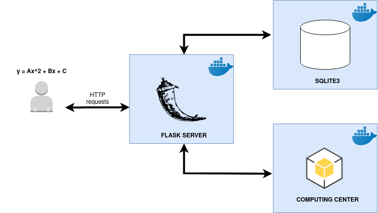

# Toy example Dockerizing a classical Stack.

In this example I am going to set up a Flask server with an Sqlite3 database. The idea is to put each service into a container, and allow communication between them. The Flask server will display a little html page that allows the user to enter three numbers that represent the coordinates of a second dregree polynomial equation. This values will be stored in the SQLITE3 database. Further, there will be another container that takes care of all the 'heavy' computation and extracts 1000 of points belonging to that polynomial curve. The architecture is the following:

To run the example first create the Docker iamges using the docker file. Name the micro 1 and micro2 `micro1-flaskserver` and `micro2-compute-center` respectively. Then run `docker-compose up -d` to build the containers. Go to `hhtp:0.0.0.0:8080` to see the webpage. 
